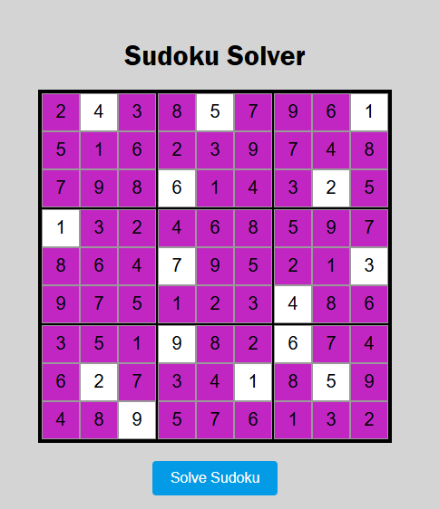

# Sudoku-solver
This is a Sudoku solver that checks if a board is a valid one for this puzzle. It also completes the puzzle after the user introduces its inputs.

To play with it withoud downloading all the proyect [click here](https://abigailgv.github.io/Sudoku-solver/)

## ScreenShoot
